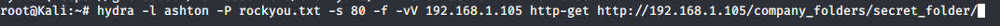
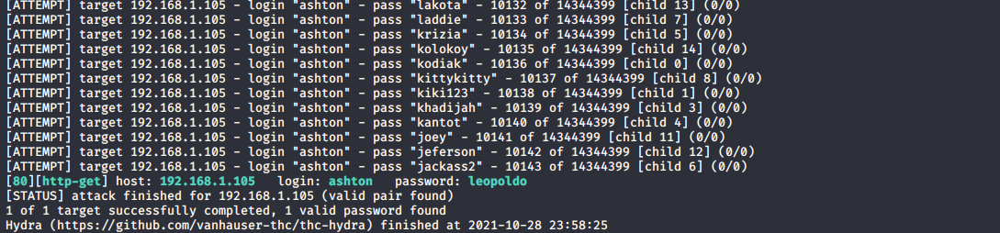
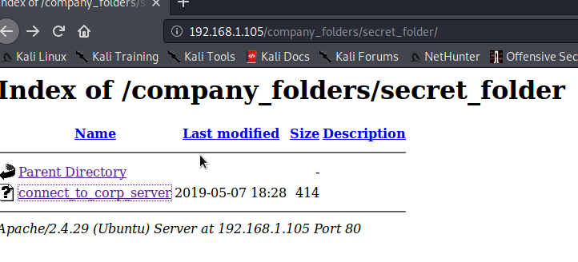
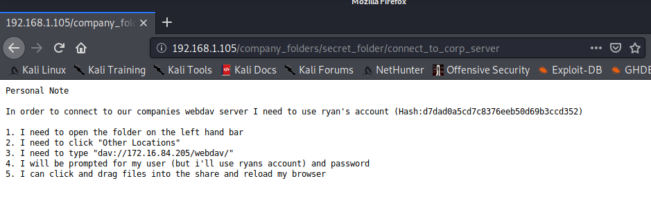
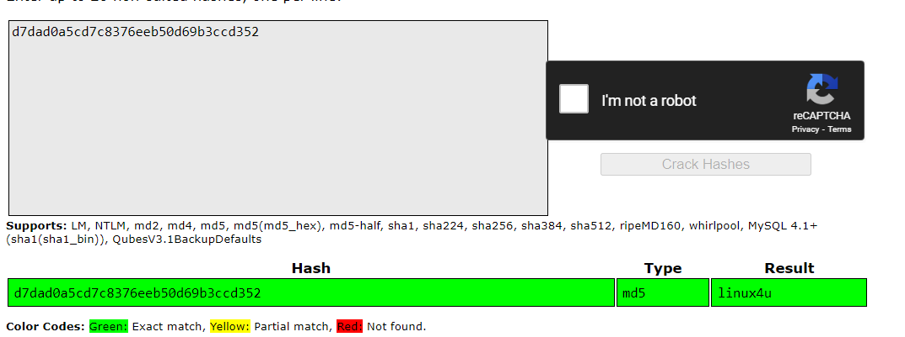
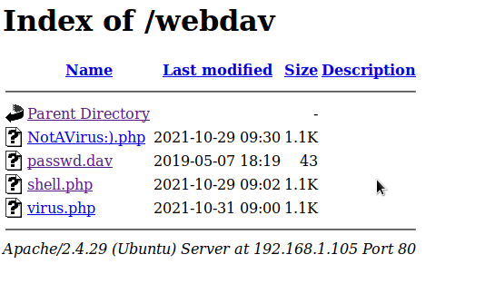
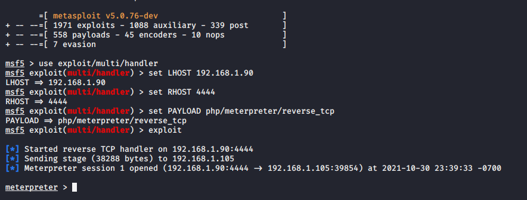
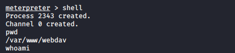
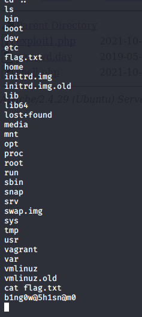

### Attack!

Today, you will act as an offensive security Red Team to exploit a vulnerable Capstone VM.

You will need to use the following tools, in no particular order:
- Firefox
- Hydra
- Nmap
- John the Ripper
- Metasploit
- curl
- MSVenom

### Setup

Your entire attack will take place using the `Kali Linux` Machine.

- Inside the HyperV Manager, double-click on the `Kali` machine to bring up the VM login window.

- Login with the credentials: `root:toor`

### Instructions

Complete the following to find the flag:

- Discover the IP address of the Linux web server.
- 
     
     
- Locate the hidden directory on the web server.

     
     
- Brute force the password for the hidden directory using the hydra command:
    - **Hint**: You may need to use `gunzip` to unzip `rockyou.txt.gz` before running Hydra.
   
    
    
    
    
    
    
- Break the hashed password with the Crack Station website or John the Ripper.

     

     

     

- Connect to the server via WebDav.
    - **Hint**: Look for WebDAV connection instructions in the file located in the secret directory. Note that these instructions may have an old IP Address in them, so you will need to use the IP address you have discovered.
    
     
    
- Upload a PHP reverse shell payload.
    - **Hint**: Try using your scripting skills! MSVenom may also be helpful.

     -Before:
     
     
     
     -After:
     
     

- Execute payload that you uploaded to the site to open up a meterpreter session.

     
     
     

- Find and capture the flag.

     

After you have captured the flag, show it to your instructor.

Be sure to save important files (e.g., scan results) and take screenshots as you work through the assessment. You'll use them again when creating your presentation.
