## Day 2 Activity File: Incident Analysis with Kibana

Today, you will use Kibana to analyze logs taken during the Red Team attack. As you analyze, you will use the data to develop ideas for new alerts that can improve your monitoring.

**Important**: Any time you use data in a dashboard to justify an answer, take a screenshot. You'll need these screenshots when you develop your presentation on Day 3 of this project.

:warning: **Heads Up**: To complete today's part of the project, you must complete steps 1-6 from the last class. Finding the flag isn't critical, but you want to get past the point of uploading the reverse shell script.

### Instructions

Even though you already know what you did to exploit the target, analyzing the logs is still valuable. It will teach you:
- What your attack looks like from a defender's perspective.

- How stealthy or detectable your tactics are.

- Which kinds of alarms and alerts SOC and IR professionals can set to spot attacks like yours while they occur, rather than after.

After creating your dashboard and becoming familiar with the search syntax, use these tools to answer the questions below:

1. Identify the offensive traffic.
   - Identify the traffic between your machine and the web machine:

- When did the interaction occur?
     
     Attacking machine (Kali): 192.168.1.90	
     
     Target (Victim) machine: 192.168.1.105
     
Traffic between the 2 machines occurred on October 31st between the time of 3:30 A.M. and 4:30 A.M.. There was a massive spike in traffic around 3:50 A.M for about 5 minutes. This is probably when the Brute-Force-Attack occurred.

   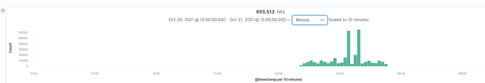

- What responses did the victim send back?
     
 The table below shows the top response codes sent back to the Kali machine.
 
 There were over 16,000 401 (unauthorized) reponse codes sent back to the Kali machine, just during the Brute-Force-Attack.
 
   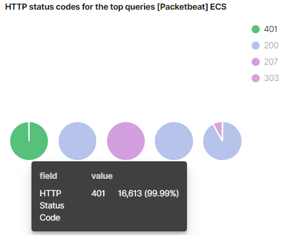
   
   

- What data is concerning from the Blue Team perspective?
     
More than 15,000 unauthorized response codes were issued within a matter of minutes. During this time, only 2 200 (authorized) response codes were issued. This means that out of at least 15,000 attempted logins, only 2 were successful.
     
The graph below shows the massive spike in web traffic that happen within minutes. This graph alone would signal suspicious behavior.

   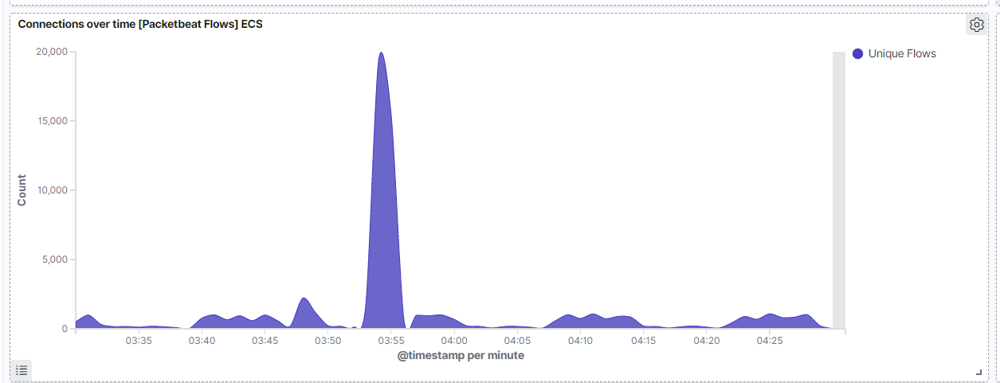

2. Find the request for the hidden directory.
   - In your attack, you found a secret folder. Let's look at that interaction between these two machines.

- How many requests were made to this directory? At what time and from which IP address(es)?

Before the Brute-Force-Attack, I was able to spot 4 http requests made towards the hidden directory. This took place around 3:51 from 192.168.1.90 (Kali).

A few minutes later, I was able to spot more than 16,000 requests made to that directory within 3 minutes. All these requests came from the 192.168.1.90 ip address.

   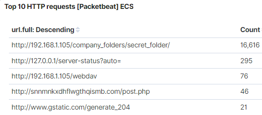
   
   
   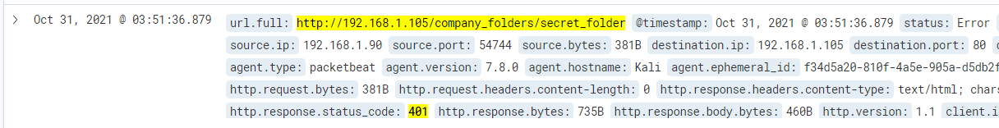
   
   

- Which files were requested? What information did they contain?

The webpage/folder requested: http://192.168.1.105/company_folders/secret_folder/

The hidden directory contained a link: “connect_to_corp_server”. The link contained instructions on how to connect to the company’s webdav server.

- What kind of alarm would you set to detect this behavior in the future?

You can also set an alert to notify us when an unknown ip address requests access to the hidden directory.

To alert us of a potential Brute-Force Attack, you can set an alarm that would notify us when a specific number of failed login attempts occur within a 5 minute timespan.

- Identify at least one way to harden the vulnerable machine that would mitigate this attack.

Only allow ip addresses from known (employee) ip addresses to access the hidden directory. 

The directories/webpages open to the public that revealed information about how to get to the hidden directory. As a company, we need to make sure no confidential information can be seen by anyone on the internet. It would be best to keep this file and/or directory off this server.

3. Identify the brute force attack.
   - After identifying the hidden directory, you used Hydra to brute-force the target server. Answer the following questions:

- Can you identify packets specifically from Hydra?

Yes. “Hydra” can be found in the user_agent.original field.

   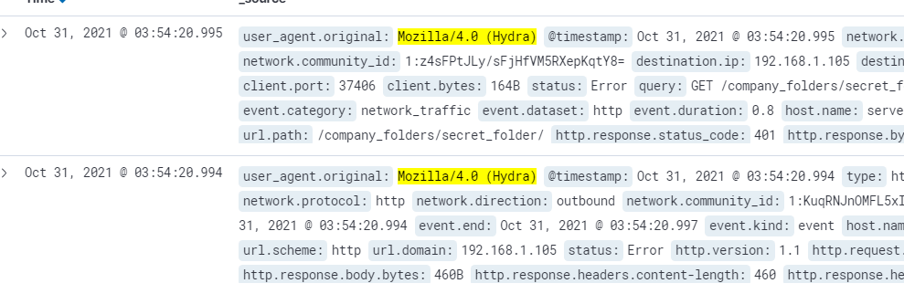
   
   
   
- How many requests were made in the brute-force attack?

Between 3:53 A.M. and 3:55 A.M., a total of 16,616 http get requests were made from 192.168.1.90 (Kali) to 192.168.1.105 (Victim).

   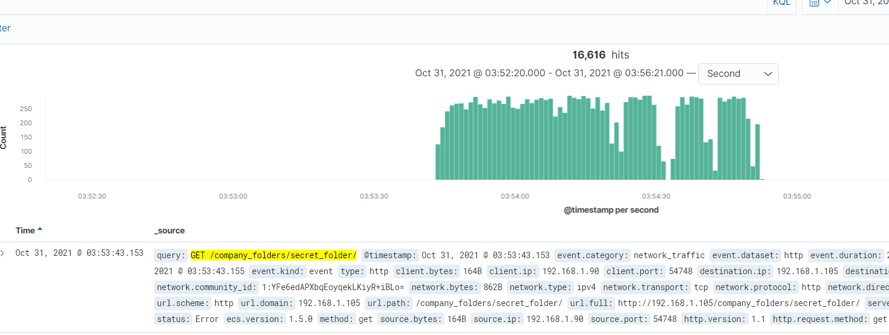
   
   
   
- How many requests had the attacker made before discovering the correct password in this one?

A total of 16,614 requests were made before the correct password was found.

- What kind of alarm would you set to detect this behavior in the future and at what threshold(s)?

To alert us of a potential Brute-Force Attack, you can set an alarm that would notify us when a specific number of 401 error codes are generated within a 5 minute timespan. For example, more than 50 failed login attempts within a 5 minute timespan would alert us.

We can also set an alarm to notify us when “Hydra” is located in the user_agent.original field.

     
- Identify at least one way to harden the vulnerable machine that would mitigate this attack.

Set a maximum of 5 failed login attempts before the user’s account is locked. The account can be locked out for a specific duration of time, or the user would be required to contact the company’s IT department to reset password and unlock the account.

You can also set a limit of http requests allowed from one ip address within a specific time span. For example: One ip address can not send more than 50 https requests to the hidden directory within a 5 minute time span.

4. Find the WebDav connection.
   - Use your dashboard to answer the following questions:

- How many requests were made to this directory? 

During the time the web traffic spiked, I was able to generate a graph that shows the requests made to the WebDav directory:

   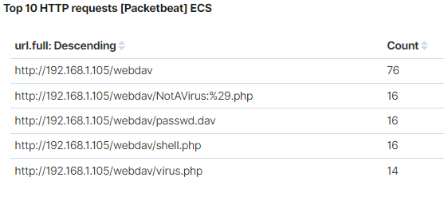
  

- Which file(s) were requested?

The WebDav directory was requested for access by a user. At that time, there was 1 filed (passwd.dav) located in the directory. 
*side note*.. I uploaded a few different files to the directory during the attack (Day 1) just to mess around a bit.

   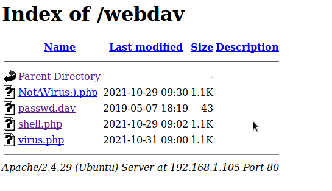
   
   

- What kind of alarm would you set to detect such access in the future?

Similar to the alarm designed for question #2, I would recommend an alarm to notify us when an unknown ip address requests/gains access to the WebDav connection. We would need to keep a record of all employee ip addresses in order to create this alarm. Any ip address not on record that is requesting access would send us a notification.

- Identify at least one way to harden the vulnerable machine that would mitigate this attack.

1 - Limit this sort of access on a company’s webpage.

Again, there seemed to be confidential information (instructions on how to gain access and upload to WebDav server) that was available on the server. If a hacker is somehow able to gain access to this directory, they would be able to do more damage by uploading malicious files/scripts to the server.

2 - Allow only known (employee) ip addresses to access the server.

5. Identify the reverse shell and meterpreter traffic.
   - To finish off the attack, you uploaded a PHP reverse shell and started a meterpreter shell session. Answer the following questions:

- Can you identify traffic from the meterpreter session?

It was hard to find traffic that identified with a meterpreter session. I did not see anything that specifically mentioned meterpreter, metasploit, (ect..) inside the packets. However, alot of traffic coming from the suspicious ip address ran over port 4444. Port 4444 is the default port used to establish a meterpreter session. You can search for traffic coming from that port. Around 4:00 A.M., I was able to find web traffic coming from the WebDav server and the Kali machine.

   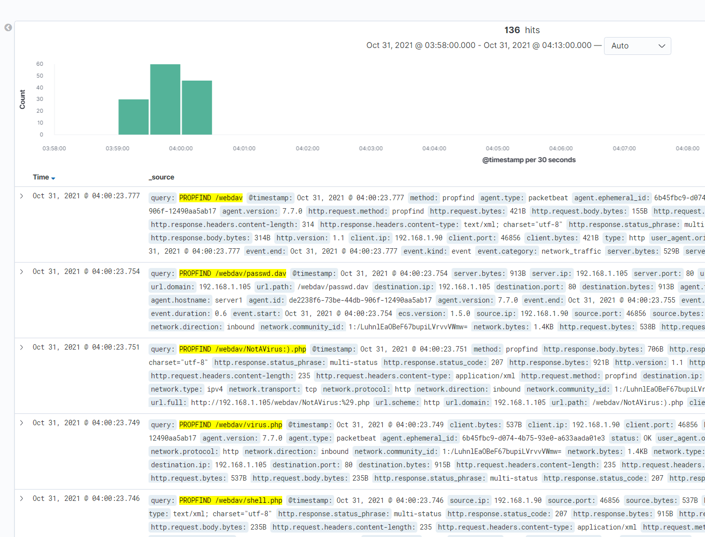
   
I took a screenshot (below) of all the meterpreter session activity.

   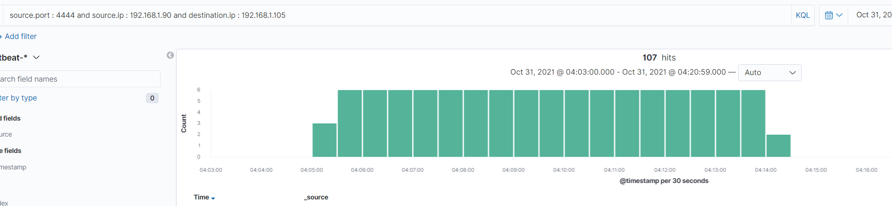
    
    
    
- What kinds of alarms would you set to detect this behavior in the future?

During the attack (Day 1) I uploaded a few different files to the WebDav server just to mess around.

The goal is to eliminate the possibility of an unauthorized user getting this far and accessing the WebDav server. However, if an cybercriminal made it this far:

I would create an alarm to alert me whenever traffic involves port 4444.

An alarm can also be created to notify us whenever a new php file is uploaded to the server.

- Identify at least one way to harden the vulnerable machine that would mitigate this attack.

If the proposed mitigation methods above did not prevent a cybercriminal gaining access to the WebDav server - Set a rule that only allows authorized users from a specific ip address to upload files to the server, or entirely removing the ability to upload files over the web interface. 
